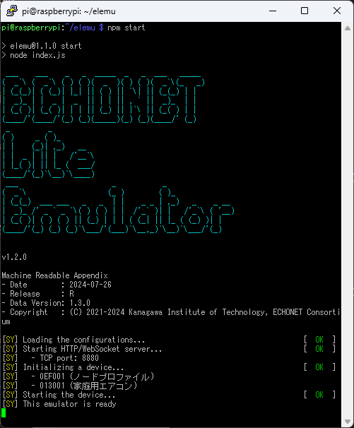
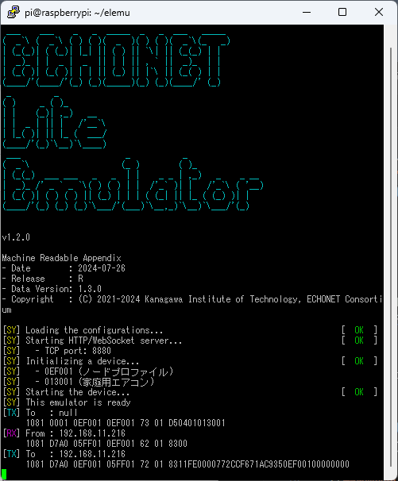
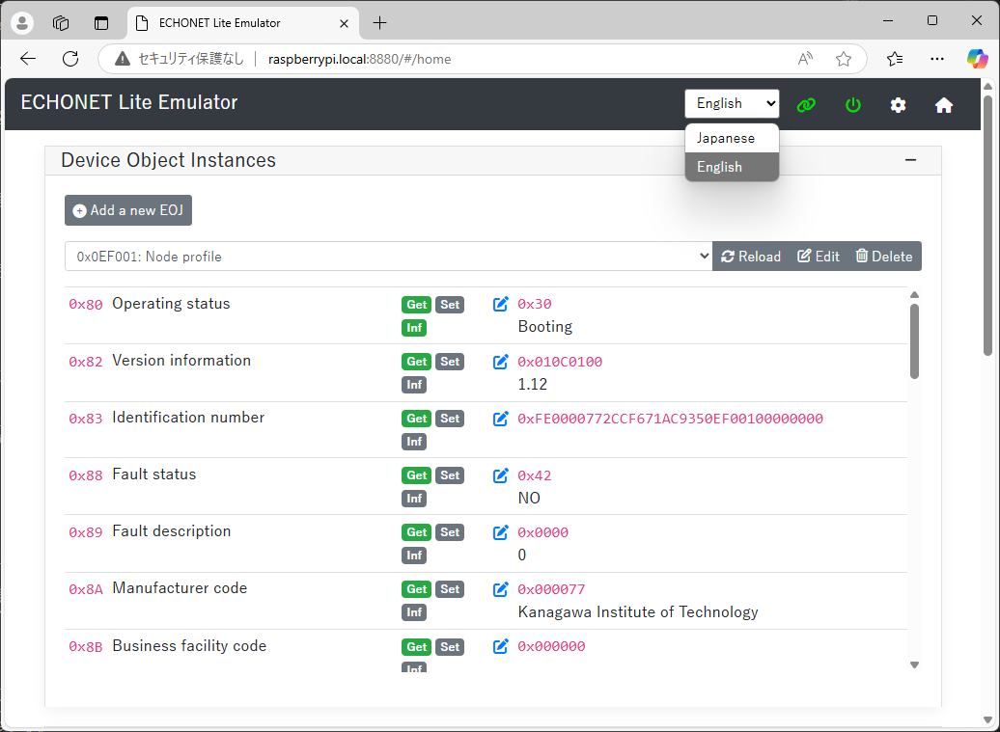
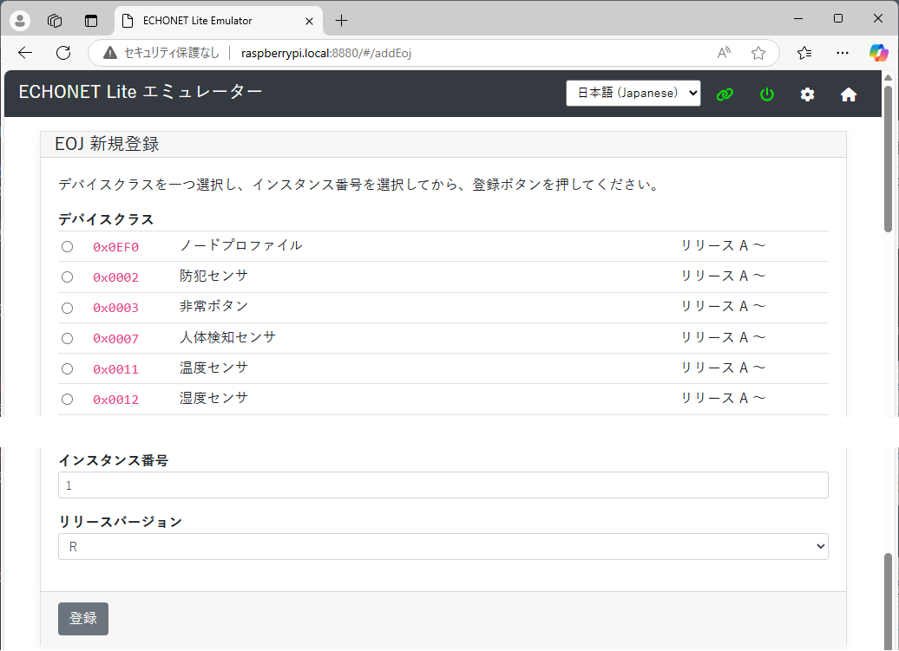
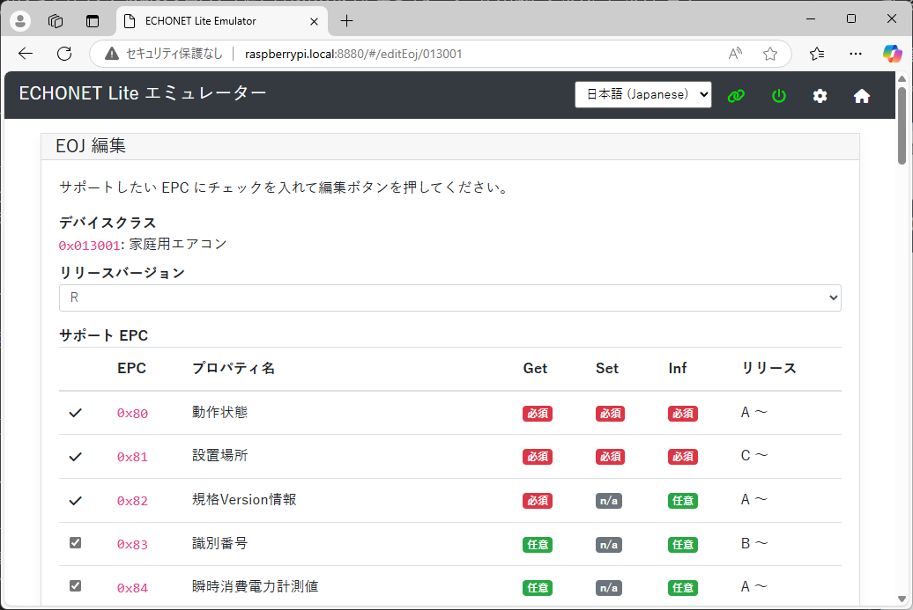
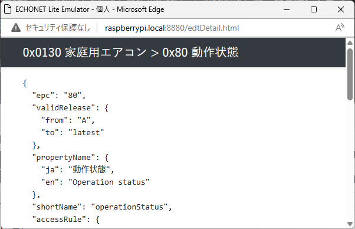
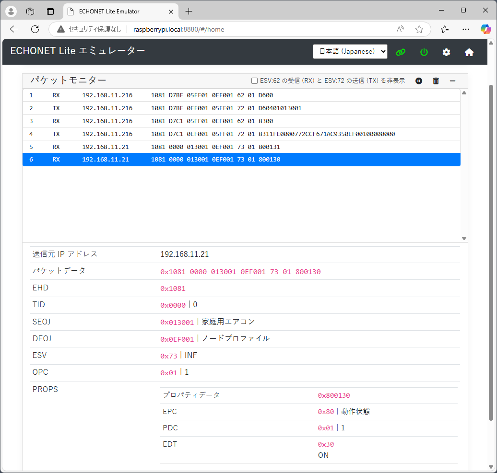
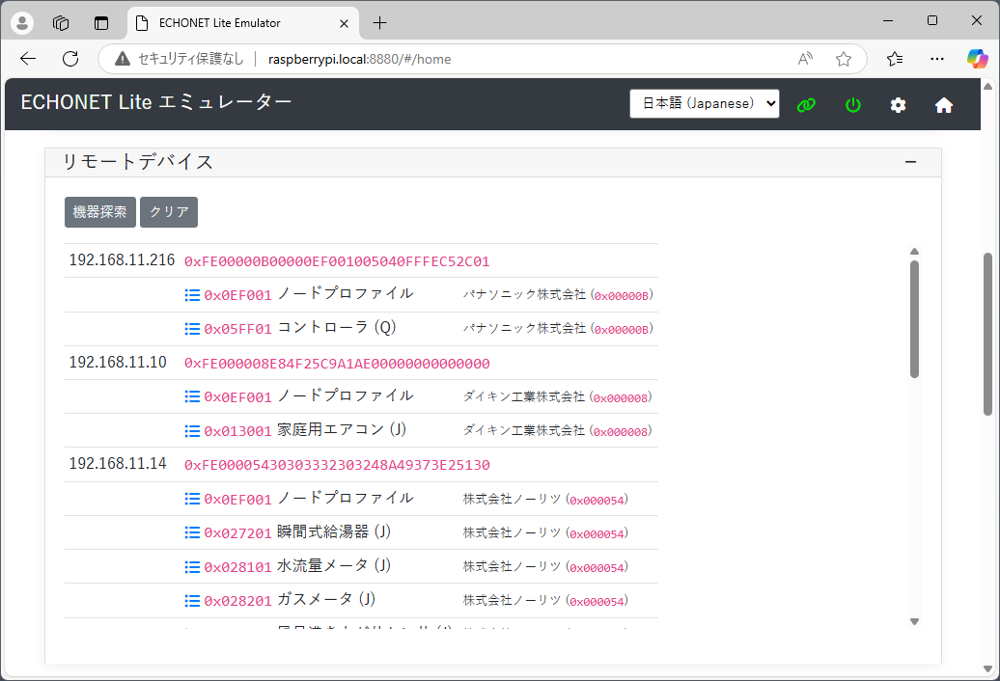
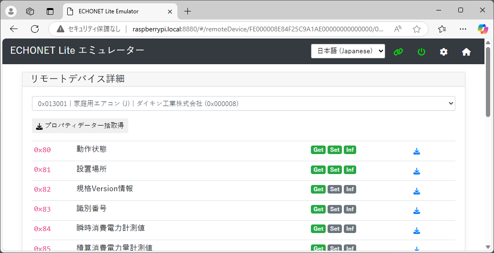

EL エミュレータ ユーザーマニュアル
===============
2024-12-06

---------------------------------------
## 目次

* [環境セットアップ](#setup-environment)
* [EL エミュレータの起動](#startup-emulator)
* [ダッシュボードの起動](#access-dashboard)
* [ヘッダーアイコン](#header-icons)
* [システム設定](#sys-conf)
* [デバイスオブジェクトインスタンス](#device-object-instances)
* [パケット送信](#packet-sender)
* [パケットモニター](#packet-monitor)
* [コントローラー](#controller)

---------------------------------------
## <a id="setup-environment">環境セットアップ</a>

### 依存関係

本エミュレーターは Node.js 上で動作します。また、いくつかの Node モジュールに依存しています。

* [Node.js](https://nodejs.org/en/)
* [express](http://expressjs.com/)
* [ws](https://github.com/websockets/ws)

[Node.js 公式サイト](https://nodejs.org/en/)の指示に従って Node.js の LTS 版 をご利用のホストにインストールしておいてください。

### 本エミュレーターの設置

本エミュレーターのディレクトリ `elemu` を、ホームディレクトリに丸ごとコピーしてください。コピーする場所はどこでも構いません。

### Node モジュールのインストール

本エミュレーターが依存している node モジュールをインストールしてください。

```
$ cd [path_to_parent_directory]/elemu
$ npm install
```

※ `[path_to_parent_directory]` の部分はご利用の環境に合わせて変更してください。

以上で、本エミュレーターを動作させるための環境構築は完了です。

### Windows でご利用になる場合の注意点

ネットワーク プロファイルが「パブリック ネットワーク」に設定されている場合、ECHONET Lite パケットの送出が妨げられる場合があります。もしパケットの送出がうまくいっていないようなら、ネットワーク プロファイルを「プライベート ネットワーク」に変更してみてください。

もし「プライベート ネットワーク」に設定を変更してもご利用になれない場合は、Windows セキュリティの設定でファイアーウォールを一時的に無効にしてください。

---------------------------------------
## <a id="startup-emulator">EL エミュレータの起動</a>

シェル（Windows なら「PowerShell」、Mac なら「ターミナル」）で EL エミュレータ本体のディレクトリ `elemu` に `cd` して EL エミュレータ を起動します。

```
$ cd [path_to_parent_directory]/elemu
$ npm start
```

※ `[path_to_parent_directory]` の部分はご利用の環境に合わせて変更してください。

`npm` コマンドを使わずに、ダイレクトに `node` コマンドで起動することもできます。

```
$ node index.js
```

起動に成功したら、シェルに次のようなメッセージが表示されます：



### パケット出力モード

もし ECHONET Lite パケットの送受信の様子をコンソール上に出力したい場合は、以下の通り、コマンドスイッチオプションを添えて起動することができます:

```
$ node index.js --enable-console-packet
```

起動が完了したあと、本エミュレーターが ECHONET Lite パケットを送受信すると、次のようなメッセージがコンソールに出力されます:




### 日時固定モード

エミュレートした機器オブジェクトの EPC 0x97 (現在時刻設定) および 0x98 (現在年月日設定) は、Get すれば常に現在日時を返します。これは、EPC 0x97, 0x98 は OS のクロックと同期した形でエミュレートされているためです。

もし OS クロックとの同期を取りやめたい場合は、次のように起動オプション `--disable-clock-sync` を指定してください。

```
$ node index.js --disable-clock-sync
```

このモードで動作した場合、デバイスオブジェクトの EPC 0x97 (現在時刻設定) および 0x98 (現在年月日設定) は 0001-01-01 00:00 を表す値にセットされます。また、OS クロックと同期しないため、Set しない限り、これら値が変更されることはありません。

---------------------------------------
## <a id="access-dashboard">ダッシュボード</a>

ダッシュボードは Web ブラウザー上で動作する Web アプリとして提供されます。EL エミュレータが起動しているホストコンピュータに対して Web ブラウザーを使って TCP ポート 8880 番でアクセスすると、ダッシュボードが表示されます。もし本エミュレーターを起動したマシン上でブラウザーを開いてダッシュボードにアクセスする場合は、次の URL にアクセスしてください。

```
http://localhost:8880
```

もし本エミュレーターを起動しているコンピューターと、ダッシュボードを表示するコンピューターが異なる場合は、本エミュレーターを起動しているコンピューターが Raspberry Pi で、かつ、ローカルネットワーク上に 1 台しか Raspberry Pi が存在せず、かつ、ダッシュボードを表示するコンピューターが Bonjour (mDNS/DNS-SD) をサポートしていれば、次の URL でアクセスできます。

```
http://raspberrypi.local:8880
```

もし上記 URL でアクセスできない場合は、本エミュレーターを起動しているコンピューターの IP アドレスを直接指定してください。

```
http://192.168.11.3:8880
```

ダッシュボードにアクセスできたら、ブラウザー上に次のような画面が表示されるはずです。


---------------------------------------
## <a id="header-icons">ヘッダーアイコン</a>

ダッシュボードのヘッダー部には、いくつかのアイコンがあります。それぞれの意味は以下の通りです。


### 言語設定

本ダッシュボードは日本語表記と英語表記に対応しています。プルダウンで言語を選択すると、自動的に表示が指定の言語に切り替わります。




### WebSocket リンクアイコン


このアイコンは、ダッシュボードとエミュレーター間の WebSocket コネクションの状態を表します。正常に接続している場合は緑色で、切断されている状態ではグレーで表示されます。もしグレーで表示されている場合は、エミュレーターが正しく起動しているかを確認してください。

### 電源ボタンアイコン


エミュレーターが起動状態であれば緑色で表示されます。このアイコンをクリックすると、エミュレーターを停止することができます。停止状態であれば、このアイコンはグレーで表示されます。再度、このアイコンをクリックすると、エミュレーターが起動し、緑色に変わります。

なお、このボタンでエミュレーターの状態を変更できますが、エミュレーターのプロセスをシャットダウンするわけではありません。単に、エミュレーターとしての動作を停止しているだけです。オフにしてもエミュレーターのプロセスは動作し続けていますので、ダッシュボードそのものは操作可能です。

### 設定ボタン


このボタンを押すと、エミュレーターの設定画面が開きます。詳細は、「[システム設定](#sys-conf)」をご覧ください。

### ホームボタン


ホーム画面ではない画面を開いているときにこのボタンを押すと、ホーム画面に戻ります。

---------------------------------------
## <a id="sys-conf">システム設定</a>

この画面では、本エミュレーターの動作を決めるパラメーターをセットします。通常は変更の必要はありませんが、必要に応じて設定してください。


画面下に「システムをリセットする」ボタンがあります。このボタンを押すと、本エミュレーターが初期状態にリセットされます。ただし、このシステム設定のパラメーターは初期化されません。

---------------------------------------
## <a id="device-object-instances">デバイスオブジェクトインスタンス</a>

トップ画面の「デバイスオブジェクトインスタンス」エリアは、エミュレートするデバイスを管理します。デフォルトでは、ノードプロファイル (EOJ:`0x0EF001`) と家庭用エアコン (EOJ: `0x013001`) が登録されています。

プルダウンメニューでデバイスを切り替えると、その下に該当のデバイスのプロパティ一覧とそれぞれの値が表示されます。


### EOJ 新規登録

「EOJ 新規登録」ボタンを押すと、エミュレートするデバイスを新規に登録する画面が表示されます。



追加したいデバイスクラス、インスタンス番号、リリースバージョンを選択して「登録」ボタンを押します。登録が完了した時点で、該当のデバイスがエミュレーター上でアクティブになります。

### 再読込

プルダウンメニュー横の「再読込」ボタンを押すと、最新のプロパティ値を再表示します。エミュレーターが外部から SetC や SetI コマンドを受信することによってプロパティ値が変更されている可能性があります。そのため、最新のプロパティ値を確認できるよう、本ボタンが用意されています。

### 編集

プルダウンメニュー横の「編集」ボタンを押すと、該当のデバイスの編集画面が表示されます。



EOJ 編集画面では、リリースバージョンの変更、サポートするプロパティの選択ができます。なお、必須のプロパティについては解除することができませんので注意してください。

### 削除

プルダウンメニュー横の「削除」ボタンを押すと、該当のデバイスの削除を確認するモーダルウィンドウが表示されます。


「OK」ボタンを押すと、該当のデバイスがエミュレーターから削除されます。

---------------------------------------
## <a id="packet-sender">パケット送信</a>

トップ画面の「パケット送信」エリアは、任意の ECHONET Lite パケットをエミュレーターから送信します。


まず、宛先 IP アドレス、TID (指定しなければ自動採番)、SEOJ、DEOJ、ESV、OPC を選択します。OPC を選択すると、その指定された数に合わせた EPC 指定欄が増減します。

EPC のプルダウンメニューには、選択されている SEOJ と DEOJ に応じて、動的に内容が変わります。EDT 入力欄には 16 進数文字列を指定してください。先頭に `0x` は入れてはいけません。


EPC が選択されると、EDT 入力欄の先頭に (i) アイコンが表示されます。このアイコンをクリックすると、該当の EPC の Device Description 情報がポップアップ表示されます。これを参考に EDT を指定してください。



## <a id="packet-monitor">パケットモニター</a>




トップ画面の「パケットモニター」のエリアは、本エミュレーターが送受信した ECHONET Lite パケットを一覧で表示します。新しく送受信されたパケットはリストの下に追加され、自動的に最新のパケットが見えるようスクロールします。

パケット一覧の一つをクリックすると、そのパケットの解析結果が一覧の下に表示されます。

パケット一覧のバー右端に配置された各アイコンの意味は次の通りです。

- チェックボックス（ESV:62 の受信 (RX) と ESV:72 の送信 (TX) を非表示）
    - チェックを入れると、ESV:62 の受信 (RX) と ESV:72 の送信 (TX) のパケットに限定して一時的に非表示にします。チェックを外すと、非表示にされたパケットが表示されます。
- 再生・停止アイコンボタン
    - このパケットモニターのパケット表示を一時的に非表示にします。再度、アイコンを押すと、非表示にされたパケットが表示されます。
- ごみ箱アイコン
    - パケット一覧がクリアされます。削除したパケット情報は復元できません。

---------------------------------------
## <a id="controller">コントローラ</a>

本エミュレーターは、コントローラとしても動作可能です。本エミュレーターをコントローラとして動作させるためには、いったん「デバイスオブジェクトインスタンス」から、ノードプロファイルを除くすべてのデバイスを削除してください。そして、EOJ 新規登録画面で「コントローラ」を追加します。コントローラとして動作させるためには、ノードプロファイルではないデバイスと共存できませんので注意してください。

コントローラが追加されると、ホーム画面に新たに「リモートデバイス」エリアが加わります。



「機器探索」ボタンを押すと、機器探索パケットをマルチキャストで送信します。デバイスが新たに見つかると、このリストに自動的に加えられます。

この一覧に表示されているデバイスのリストアイコンをクリックすると、リモートデバイス詳細画面が表示されます。



この画面上段にあるプルダウンメニューから、現在、エミュレーターが発見したデバイスがリストアップされています。ここで表示したいリモートデバイスを切り替えることができます。

「プロパティデータ一括取得」ボタンを押すと、取得可能なすべてのプロパティ値を該当のリモートデバイスに対して Get して、その結果を表示します。

各プロパティの行にあるダウンロードアイコンをクリックすると、該当のプロパティ値のみを該当のリモートデバイスに対して Get して、その結果を表示します。

-----
以上